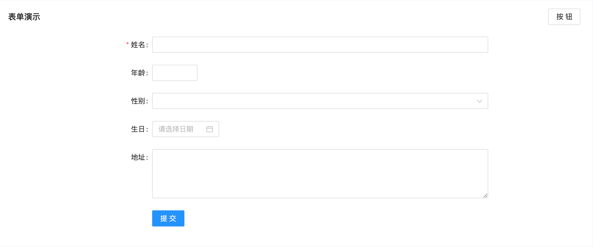

# Form组件

表单组件基于antd form封装而来



```react
import React from 'react'
import { Input, InputNumber, Select, DatePicker } from 'antd'
import Page from '@/components/page/page'
import Form from '@/components/form/form'
import Actions from '@/components/actions/actions'

export default function () {
  return (
    <Page>
      <Form>
        <Form.Group
          title="表单演示"
          actions={
            <Actions>
              <Actions.Action>按钮</Actions.Action>
            </Actions>
          }
        >
          <Form.Item name="name" label="姓名" required>
            <Input />
          </Form.Item>
          <Form.Item name="age" label="年龄">
            <InputNumber precision={0} />
          </Form.Item>
          <Form.Item name="gender" label="性别">
            <Select />
          </Form.Item>
          <Form.Item name="birthday" label="生日">
            <DatePicker />
          </Form.Item>
          <Form.Item name="address" label="地址">
            <Input.TextArea autoSize={{ minRows: 4, maxRows: 6 }} />
          </Form.Item>
        </Form.Group>
      </Form>
    </Page>
  )
}

```

***Form***

表单组件

| 属性             | 描述                                  | 默认值     |
| ---------------- | ------------------------------------- | ---------- |
| labelSpan        | label所在的位置大小，分成24块         | 6          |
| wrapperSpan      | 表单内容所在的位置大小，分成24块      | 14         |
| showSubmitButton | 是否展示提交按钮                      | True       |
| skeletonRows     | 初次loading时骨架图显示的行数         | 5          |
| loading          | 加载中                                | 无         |
| layout           | 表单布局模式horizontal/vertical       | horizontal |
| onFieldChange    | 字段改变时回调function (field, value) | 无         |
| onFieldsChange   | 移除                                  |            |
| onSubmit         | 表单提交是回调函数function (values)   | 无         |
| onFinish         | 移除                                  |            |

表格其他属性与[Antd Form](https://ant-design.gitee.io/components/form-cn/)保持一致

***Form.Group***

