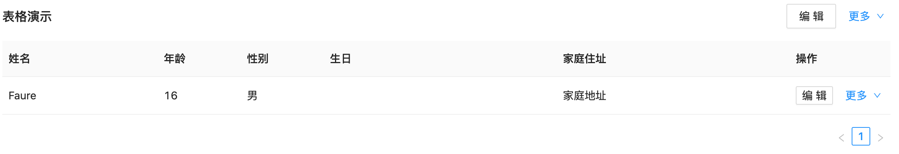

# Table组件

表格组件基于antd table封装，内置了列默认宽度，继承了antd table能力



```react
import React from 'react'
import Page from '@/components/page/page'
import Table from '@/components/table/table'
import Actions from '@/components/actions/actions'

export default function () {
  function renderActions() {
    return (
      <Actions size="small">
        <Actions.Action>编辑</Actions.Action>
        <Actions.Action>详情</Actions.Action>
        <Actions.Action danger>删除</Actions.Action>
      </Actions>
    )
  }

  return (
    <Page>
      <Table
        rowKey="id"
        title="表格演示"
        actions={
          <Actions>
            <Actions.Action>编辑</Actions.Action>
            <Actions.Action>详情</Actions.Action>
            <Actions.Action danger>删除</Actions.Action>
          </Actions>
        }
        dataSource={[
          {
            id: '1',
            name: 'Faure',
            age: '16',
            gender: '男',
            birthday: new Date(),
            address: '家庭地址',
          },
        ]}
      >
        <Table.Column title="姓名" width={200} dataIndex="name" fixed="left" />
        <Table.Column title="年龄" dataIndex="age" />
        <Table.Column title="性别" dataIndex="gender" />
        <Table.Column title="生日" width={300} dataIndex="birthday" />
        <Table.Column
          title="家庭住址"
          width={300}
          dataIndex="address"
          ellipsis
        />
        <Table.Column
          title="操作"
          fixed="right"
          width={130}
          dataIndex="action"
          render={renderActions}
        />
      </Table>
    </Page>
  )
}

```

***Table***

表格组件

| 属性    | 描述                                               | 默认值 |
| ------- | -------------------------------------------------- | ------ |
| columns | 该属性移除，通过jsx风格实现                        |        |
| title   | 表头的标题                                         | 无     |
| actions | 定义表格头操作栏，[Actions组件](COMPONENT/ACTIONS) | 无     |

表格其他属性与[Antd Table](https://ant-design.gitee.io/components/table-cn/)保持一致

***Table.ColumnGroup***

表格头分组，只能放于Table中，属性配置同[Antd Table](https://ant-design.gitee.io/components/table-cn/)

***Table.Column***

表格列

| 属性  | 描述       | 默认值 |
| ----- | ---------- | ------ |
| width | 表格列宽度 | 100    |

表格列其他属性与[Antd Table](https://ant-design.gitee.io/components/table-cn/)保持一致