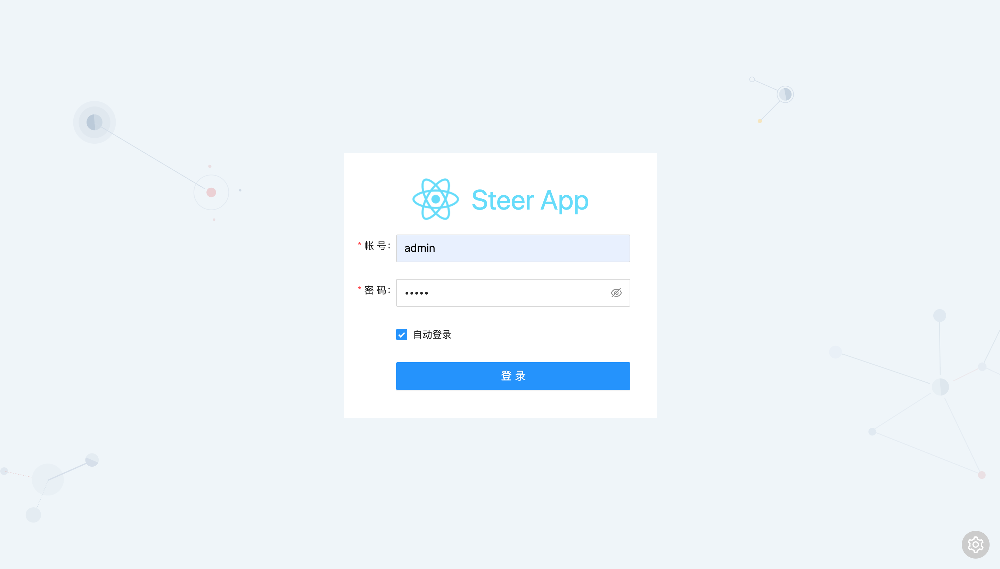
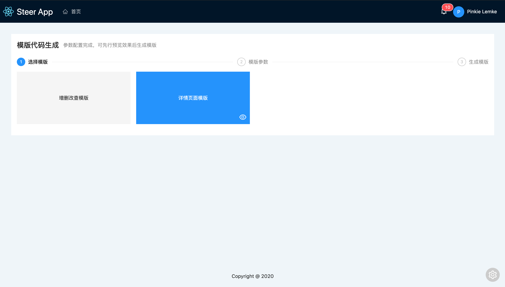
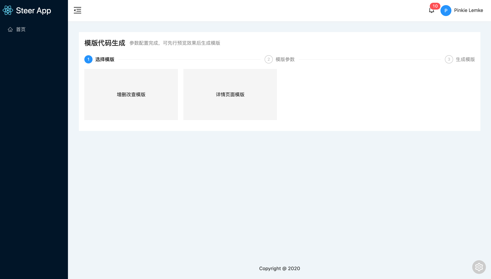
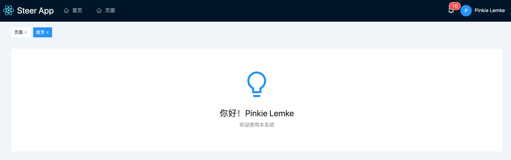

# 快速开始

本项目开箱即用，因此内部集成了部分常用功能，比如登录/登出，面包屑，常用组件封装，鉴权功能，模版代码编辑器等，同时内置了两种布局水平布局/垂直布局








## 面包屑

面包屑组件在水平/垂直布局中都以集成，无需修改即可以使用




## 用户鉴权

待补充


## 资源引用

`src`目录下的资源引用可通过`@`别名进行引用

```js
import Page from '@/components/page/page'
import logo from '@/assets/logo.png'
```

***样式资源***

本项目开启了`css module`功能使用方式如下

```js
import styles from './style.less'
```


## 菜单配置

菜单配置文件`src/config/menu.js`中


## 模版代码

请查看[模版代码编辑器文档](EDITOR/README.md)


## 全局脚本

`src/app.js`文件为本项目的全局脚本文件，该文件中定义了三个可导出变量

```js
export function render(oldRender) {
  // render函数钩子
}
```

`render`钩子函数可以用于渲染前做一些事情，比如检测登录等

```js
export function onRouteChange({ history, location, params }) {
  // 路由变化的回调钩子函数
}
```

`onRouteChange`钩子函数可用于检测路由变化，比如实现面包屑功能

```js
let messages = []
/**
 * 本项目自动集成数据处理框架zoro
 * @url https://faurewu.github.io/zoro/
 */
export const zoro = {
  onError(error) {
    if (error.message && messages.indexOf(error.message) === -1) {
      messages.push(error.message)
      delay(0).then(() => {
        message.error(error.message, 2, () => {
          messages = messages.filter((message) => message !== error.message)
        })
      })
    }
  },
}
```

`zoro`主要用于配置zoro数据框架，项目中默认全局处理了错误消息


## 全局样式

全局样式写在`src/app.less`文件中，该文件中的样式会被自动生成的入口文件引入，该文件未开启css module能力，这里可直接书写全局样式


## 主题定制

antd主题定制已集成到项目中，如果需要定制主题，直接在`src/theme.less`文件中新增或修改即可，同时该文件也是less的全局变量文件，这里定义的变量无需引入，可直接在项目中任意less文件中引用 


## 全局MODEL

本项目引入了状态管理库[zoro](https://faurewu.github.io/zoro/)，约定`src/models`下的脚本文件为自动注入的model，只需将model文件放于此文件夹中无需额外注入操作，即可使用，对于model的编写，这里不在说明，直接查看[ZORO MODEL](https://faurewu.github.io/zoro/API/MODEL.html)，项目中已编写`src/models/user.js`作为用户model，详情查看代码


## 全局PLUGIN

约定`src/plugins`下的脚本文件为自动注入的zoro plugin，只需将plugin文件放于此文件夹中无需额外注入操作，即可使用，对于plugin的编写及使用请查看[ZORO PLUGIN](https://faurewu.github.io/zoro/PLUGIN/)，项目中以引入`update` `pagination`两个mixin插件，详情查看代码


## LAYOUT布局

请查看[动态布局文档](DEVELOPMENT/LAYOUT.md)


##  动态路由

请查看[动态路由文档](DEVELOPMENT/ROUTE.md)


## 状态管理

请查看[状态管理文档](DEVELOPMENT/MODEL.md)


## 模拟数据

请查看[模拟数据](DEVELOPMENT/MOCK.md)


## 环境配置

请查看[环境配置](DEVELOPMENT/ENV.md)