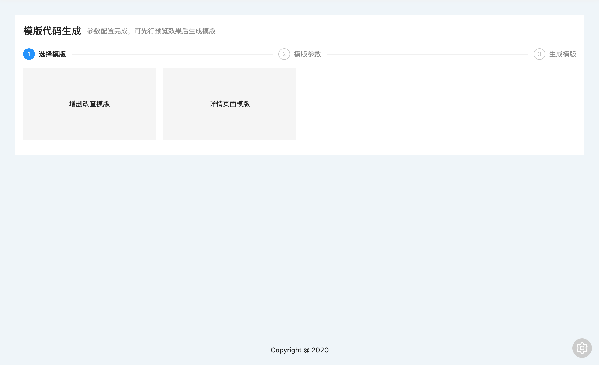

# 模版编辑器

模版编辑器的开启关闭通过`REACT_APP_EDITOR`配置，模版代码的访问路由通过`REACT_APP_TEMPLATE_EDITOR_ROUTE`环境配置指定，默认是`/editor`，对于环境变量配置有疑问的查看[环境配置](DEVELOPMENT/ENV.md)

当开启模版编辑器时，页面右下角会出现模版编辑器的快捷入口

模版代码编辑器用于快速管理代码模版，包括模版的编写，生成，预览，调试等能力

下一篇文档[如何创建模版代码](EDITOR/DEVELOPMENT.md)